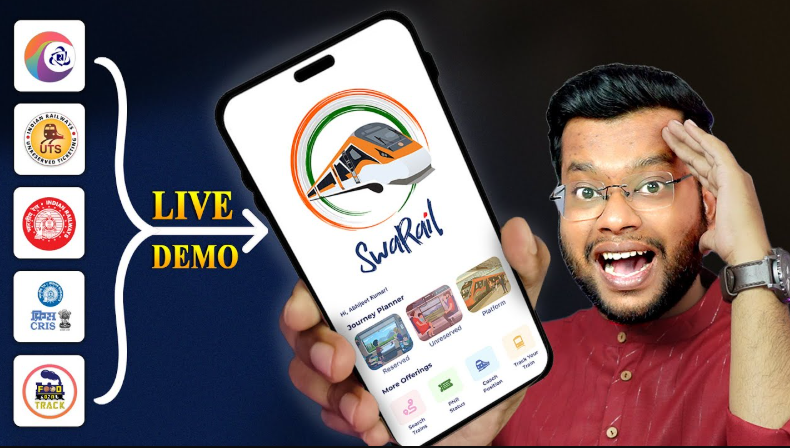

# 🚆 SwaRail APK: Revolutionizing Railway Travel in India
>[Download SwaRail APK](https://apkmodjoy.net/)
------

## 🎮 What is SwaRail APK?

SwaRail APK is an innovative mobile application developed by Indian Railways to streamline and enhance the railway travel experience. By integrating multiple functionalities into a single platform, SwaRail simplifies tasks such as ticket booking, train tracking, and accessing onboard services. This all-in-one app aims to provide passengers with a seamless and efficient journey.

## 🎮 Graphics in It

SwaRail boasts a clean and intuitive interface designed for ease of use. The app features high-quality graphics that make navigation straightforward, even for first-time users. The minimalistic design ensures that users can access various features without confusion, enhancing the overall user experience.
## 🎮 Features in It

SwaRail APK offers a comprehensive suite of features to cater to every aspect of railway travel:

* **Ticket Booking**: Easily book both reserved and unreserved tickets through the app.

* **My Bookings**: Access details and history of booked and canceled tickets in one place.

* **Real-Time Train Tracking**: Stay updated with live train statuses and schedules.

* **Onboard Services**: Request services and assistance during your journey directly through the app.

* **Multilingual Support**: Available in multiple languages, including Hindi and English, to cater to a diverse user base.

* **Secure Authentication**: Robust login systems with OTP verification ensure user data privacy and security.

## 🎮 Design and User Experience

The app's design focuses on user-centricity, offering an intuitive navigation system that allows users to access various services effortlessly. The integration of a single sign-on (SSO) system means users can log in once and access all features without repeated authentication. The app's responsiveness and minimalistic layout contribute to a smooth and efficient user experience.

## 🎮 Conclusion

SwaRail APK stands out as a transformative tool in the realm of railway travel in India. By consolidating essential services into a single, user-friendly application, it addresses common travel challenges and enhances passenger convenience. Whether you're planning a trip, booking tickets, or seeking onboard services, SwaRail ensures a hassle-free experience. Embrace the future of railway travel by downloading SwaRail APK today.